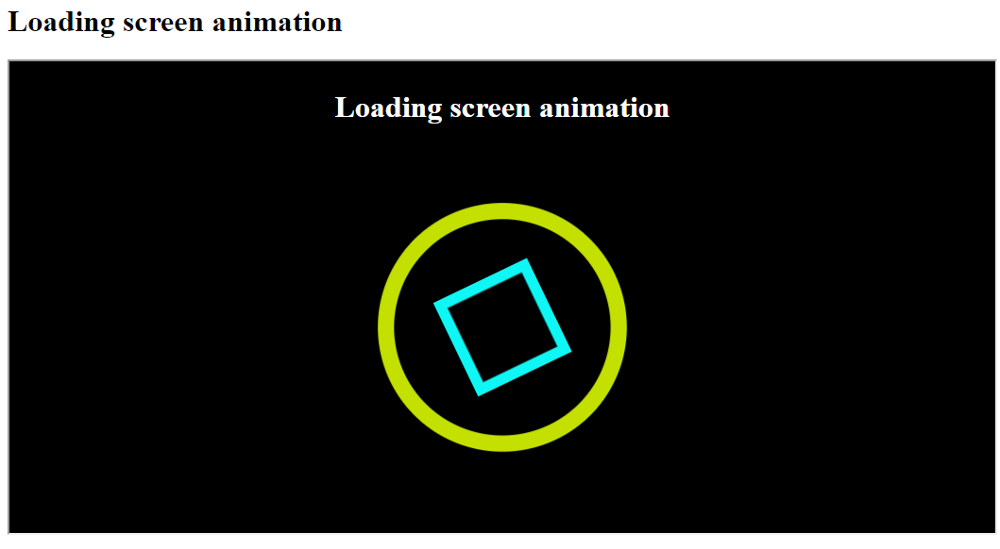

# CSS Animation Practice

This repo is the part of my frot-end development journey. In modern web app we can see there are using so many web animation. So i practice CSS animation for web animation.

## Demo

https://shajal-kumer.github.io/css-animation/

## Lessons Learned

CSS transform property and its different values

> transform: translateX | translateY | rotate | rotateY | scale | scaleX | scaleY;

-   `transform: translate(100px, 100px);`
-   `transform: rotate(25deg);`
-   `transform: scale(1.5);`

> transform-origin: x-offset y-offset |center center [default] | top left | top right | bottom left | bottom right | ;

-   `transform-origin: center center;`
-   `transform-origin: left 50px;`
-   `transform-origin: 0 0;`

> transform-box: fill-box | view-box[default];

> > The transform-box CSS property defines the layout box to which the transform and transform-origin properties relate.

> > **fill-box** : The object bounding box is used as the reference box.

> > **view-box:** The nearest SVG viewport is used as the reference box.

-   `transform-box: fill-box;`

> backface-visibility: fill-box | view-box[default];

> > The backface-visibility property defines whether or not the back face of an element should be visible when facing the user.

> > The back face of an element is a mirror image of the front face being displayed.

> > This property is useful when an element is rotated. It lets you choose if the user should see the back face or not.

-   `backface-visibility: fill-box;`

> perspective: none[default] | length | 1000px;

> > The perspective property is used to give a 3D-positioned element some perspective.

> > The perspective property defines how far the object is away from the user. So, a lower value will result in a more intensive 3D effect than a higher value.

> > Large values of perspective cause a small transformation; small values of perspective cause a large transformation.

-   `perspective: 1000px;`

CSS animation property and its different values & @keyframe

---

> animation-name: none[default] | the animation’s name;

-   `animation-name: bounce;`

> animation-duration: 0[default] | 0.5s(half a second) | 1s

-   `animation-duration: 1s;`

> animation-timing-function: ease[default] | linear | ease-in | ease-out | ease-in-out

> > **Ease:** slow start, fast middle, slow end

> > **Linear:** constant speed

> > **Ease In:** slow start, fast end

> > **Ease Out:** fast start, slow end

> > **Ease In Out:** like ease, but with more pronounced acceleration/deceleration curves

-   `animation-timing-function: linear;`

> animation-delay: 0s[default] | 1s | 2s

-   `animation-delay: 1s;`

> animation-iteration-count: 1[default] | 2 | infinite

> > integers like 2 or 3

> > non-integers like 0.5 which will play only half the animation

> > the keyword infinite which will repeat the animation indefinitely

-   `animation-iteration-count: 2;`

> animation-fill-mode: none[default] | forwards | backwards | both

> > **None:** the animation styles do not affect the default style

> > **Forwards:** the last styles applied at the end of the animation are retained afterwards

> > **Backwards:** the animation's styles will already be applied before the animation actually starts

> > **Both:** the styles are applied before and after the animation plays

-   `animation-fill-mode: forward;`

> animation-direction: normal[default] | reverse | alternate | alternate-reverse

> > **normal**: starts at 0%, ends at 100%, starts at 0% again

> > **reverse**: starts at 100%, ends at 0%, starts at 100% again

> > **alternate**: starts at 0%, goes to 100%, goes to 0%

> > **alternate-reverse**: starts at 100%, goes to 0%, goes to 100%

> @keyframes animationname {keyframes-selector {css-styles;}}

> > The animation is created by gradually changing from one set of CSS styles to another.

> > During the animation, you can change the set of CSS styles many times.

-   `@keyframes move {`
-   -   `0% {top: 0px;}`
-   -   `75% {top: 200px;}`
-   -   `100% {top: 0px;}`
-   `}`

## Screenshots

> Shopping cart Animation with CSS

> Loading Animation with CSS

> Pop-up Animation with CSS

> 3D flip animation Animation with CSS

## Tech Stack

**Client:** HTML, CSS, Javascript

## 🚀 About Me

I'm a front-end developer

## 🛠 Skills

Javascript, React, HTML, CSS, Bootstrap, Tailwind, SASS, SVG, GSAP

## Acknowledgements

1. https://developer.mozilla.org/en-US/docs/Web/CSS/perspective
2. https://www.w3schools.com/cssref/css3_pr_perspective.asp
3. https://www.w3schools.com/cssref/css3_pr_backface-visibility.asp
